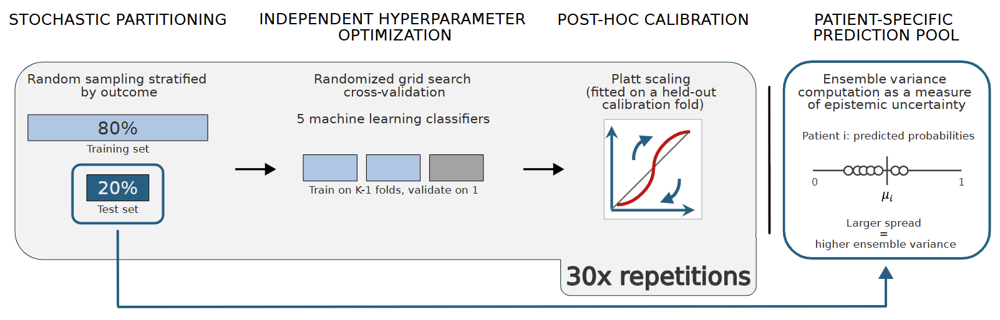
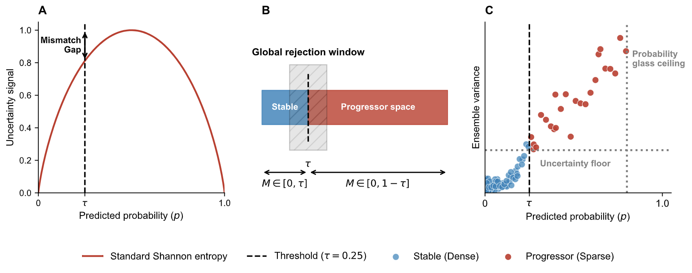

# Uncertainty and Rejection under Clinical Class Imbalance



*Figure 1: Dynamic Calibrated Ensemble Generation and Uncertainty Quantification Workflow.*

## Research Concept
Standard machine learning evaluation assumes predictive uncertainty can be thresholded independently of a dataset's class prior. In clinical practice, this assumption fails catastrophically. To safely translate predictive models into actionable Clinical Decision Support Systems (CDSS) without abandoning high-risk minority patients, we implemented the following workflow:

**0. Dynamic Calibrated Ensemble Generation**
The mathematical integrity of any uncertainty-based rejection system depends entirely on the reliability of the underlying probability distributions. The pipeline enforces strict probability calibration (Platt scaling) across 30 bootstrapped iterations of heterogeneous base classifiers. This asynchronous ensemble captures both algorithmic and data variance, providing a highly robust, patient-specific distribution of probabilities ($p$) and ensemble disagreement ($\sigma^2$, often used as a proxy for epistemic variance).

**1. Resolving the Threshold-Entropy Mismatch ($H_\tau$)**
Standard Shannon binary entropy assumes maximum ambiguity always occurs at $p = 0.5$. In imbalanced clinical datasets, the decision boundary ($\tau$) naturally shifts (e.g., $\tau = 0.13$). Instead of applying uncorrected entropy, we introduce a **Threshold-aware ambiguity score ($H_\tau$)**. This mathematically warps the asymmetric probability space so that the clinical boundary ($\tau$) sits exactly at the physical center of the entropy curve, realigning maximum mathematical uncertainty with maximum model ambiguity.

**2. Class-Conditioned Rejection (CCR)**
To prevent global uncertainty thresholds from acting as a naive minority-class deletion filter, the workflow utilizes **Class-Conditioned Rejection (CCR)**. By evaluating the ordinal ranking of $H_\tau$ strictly within localized predicted trajectories, CCR neutralizes prior-driven bias, bypasses epistemic sparsity, and defers ambiguous patients without mathematically erasing the disease class.

**3. Class-Conditioned Evaluation (ccAUGRC)**
Standard multi-threshold metrics (like AUGRC) suffer from "risk-masking" under imbalance: models can artificially improve their global score by systematically substituting high-risk minority patients with low-risk majority patients. We resolve this by computing generalized risk-coverage independently for each clinical trajectory (**ccAUGRC**), proving whether safety is maintained across all patient groups.

**4. Cross-Disease Validation**
To ensure the pipeline is robust across varying degrees of biological noise and class imbalance, we mapped the phase diagram of algorithmic failure across 56 synthetic conditions and evaluated the framework on three neuro-predictive cohorts:
* **Parkinson’s Disease (3-Year Dyskinesia, $\tau=0.39$):** A moderately imbalanced cohort testing the algorithm's ability to stabilize asymmetric noise.
* **Multiple Sclerosis (PIRA, $\tau=0.13$):** A severely imbalanced cohort testing CCR as a mandatory rescue mechanism against systemic minority-class collapse.
* **Alzheimer’s Disease (36-Month MCI to AD, $\tau=0.54$):** A near-balanced cohort testing the framework's ability to safely converge to baseline behavior.

**5. Synthetic Validation**
A controlled experimental environment mapping the phase diagram of algorithmic failure across varying degrees of synthetic noise and imbalance.

---


*Figure 2: Structural uncertainty divergence and the threshold-entropy mismatch under clinical class imbalance.*

## Main Findings 

**1. Structural Uncertainty Divergence**
Across multiple clinical forecasting domains, we observed that predictive uncertainty is structurally concentrated on the minority class. Due to inherent epistemic sparsity, minority-class predictions carry systematically higher ensemble variance than majority predictions—even when evaluated at the exact same distance from the decision boundary.

**2. Global Rejection Acts as a Naive Deletion Filter**
Our analysis proves that applying standard global rejection thresholds (like $H_{Total}$ or Margin) weaponizes this uncertainty divergence. Global rejection acts as a naive deletion filter, systematically discarding the most difficult-to-predict minority patients and causing sensitivity to artificially crash.

**3. Breaking the Sensitivity-Specificity Trade-off**
We demonstrate that CCR + $H_\tau$ is the only framework capable of safely discarding ambiguous patients without erasing the minority class. By realigning the entropy signal and isolating triage queues, it mathematically prevents the systemic deletion of high-risk patients while stabilizing overall performance.

**4. Unmasking Algorithmic Bias in Evaluation**
We establish that standard global evaluation metrics are dangerously misleading under imbalance. Frameworks that appeared "safe" globally were actively abandoning rapid progressors. ccAUGRC exposes this bias and proves our proposed framework is the only method that bounds risk for all patient trajectories simultaneously.

**5. The Scaling Law of Class Imbalance**
Our cross-disease application revealed that the clinical necessity and functional role of CCR scale directly with the baseline balance of the dataset:
* In severely imbalanced datasets (MS), CCR acts as a **Mandatory Rescue Mechanism** to prevent the total collapse of Sensitivity.
* In moderately imbalanced datasets (PD), it acts as a **Stabilization Tool** to halt progressive minority erosion.
* In near-balanced datasets (AD), the risk of erasure dissolves, and the framework acts as a **Safe Convergence Engine**, matching standard baseline performance without introducing artificial penalties.

**6. Operationalizing the Clinical "Abstain" Option**
CCR transitions predictive models from rigid binary classifiers into safe CDSS. By accurately bounding uncertainty without destroying class integrity, the framework provides a mathematically rigorous mechanism for models to "abstain" from prediction. Deferring the top 20-30% of class-conditioned ambiguous cases to secondary screening represents the necessary operational blueprint for deploying AI in high-stakes biological environments.

---

## Repository Structure

The codebase is organized into modular directories handling the core classification pipeline, validation on both real-world and synthetic datasets, and dataset-specific preprocessing.

### Core Pipeline
* **`code_classification/`**: Contains the main classification pipeline, including data preprocessing, model training, and evaluation scripts.
  * `main_calibrate.py`: Implements dynamic calibrated ensemble generation, nested cross-validation, and Sigmoid calibration for uncertainty quantification.

### Real-World Validation
* **`code_real_world_validation/`**: Implements the uncertainty quantification (UQ) and rejection protocol for cross-disease validation on real-world clinical datasets.
    * Please refer to the specific readme inside the folder for more information.
### Synthetic Validation
* **`code_synth_validation/`**: Contains scripts for generating synthetic data and conducting controlled experiments to test method robustness.
    * Please refer to the specific readme inside the folder for more information.

### ADNI-Specific Pipelines
* **`code_data_prep_adni/`**: Handles ADNI dataset preprocessing, including data cleaning, feature extraction, and formatting for model training.
* **`code_evaluate_adni/`**: Evaluates model performance specifically on the ADNI dataset, including metric calculation and results visualization.

---

## Usage Guide: Synthetic Validation

**Important Note:** Before executing these steps, please ensure you check and update all file and directory paths in the commands below to match your local repository structure.

### Step 1 - Generate the data 
```bash
python3 1_synthetic_generator.py
```
*Creates `synthetic_data/` with 56 condition folders and a `manifest.csv`.*

### Step 2 - Generate configs and commands file (once)
```bash
python3 2_generate_synthetic_configs.py \
    --manifest  ../data/synthetic_data/manifest.csv \
    --template  config_synthetic_template.ini \
    --code_path ../code_classification \
    --script    main_calibrate.py \
    --output    ../data/synthetic_data/synthetic_commands.txt
```

### Step 3 - Submit the array
```bash
sbatch sbatch_synthetic_.sh
```

### Step 4 - Create the ensemble predictions
```bash
python3 3_build_h_ensembles.py \
    --manifest     ../data/synthetic_data/manifest.csv \
    --results_root ../data/synthetic_results
```

### Step 5 - Compute uncertainty scores

```bash
python3 4_compute_uncertainty_scores.py \
    --input  ../data/synthetic_results/all_conditions_summary.csv \
    --output ../data/synthetic_results/all_conditions_uncertainty.csv
```

### Step 6 - Compute rejection metrics
```bash
python3 5_compute_rejection_metrics.py \
    --input   ../data/synthetic_results/all_conditions_uncertainty.csv \
    --out_dir ../data/synthetic_results
```

### Step 7 - Generate all figures
* Generates core synthetic manuscript figures (Sensitivity Stability, Failure Map, Separability Interaction, and Appendix Rejection Curves):
```bash
python3 6_visualize_phase_diagram.py \
    --scalars ../data/synthetic_results/scalar_summaries.csv \
    --curves  ../data/synthetic_results/rejection_curves.csv \
    --out_dir ../figures/synthetic
```

### Step 8 - Structural Divergence Vaidation
* Generates the synthetic asymmetry test validation figure evaluating uncertainty gaps across prevalence thresholds:
```bash
python3 8_structural_divergence_validation.py \
    --in_dir  ../data/synthetic_results/ \
    --out_dir ../figures/paper/
```

### Step 9 - Sensitivity Analysis & Density Ablation
* Generates supplementary figures demonstrating structural vulnerabilities under varying cost matrices and distribution overlaps:
```bash
python3 1r_sensitivity_analysis.py
```

---

## Usage Guide: Real-World Validation

### Step 1 - Generate Heterogeneous Ensembles
* Creates the aggregated ensemble predictions for Parkinson's Disease (PD), Multiple Sclerosis (MS), and Alzheimer's Disease (AD).
```bash
python3 1_h_ensemble.py ../results/classification/pd_dyskinesia/FutureDyskinesia
python3 1_h_ensemble.py ../results/classification/ms_progression/progression_independent_from_relapses
python3 1_h_ensemble.py ../results/classification/mci_ad_conversion/label_bl_36m
```

### Step 2 - Compute Uncertainty Metrics
* Computes total predictive uncertainty and class-conditioned rejection curves.
```bash
python3 2_compute_uncertainty_metrics.py \
    --ms_path  ../results/classification/ms_progression/progression_independent_from_relapses/aggregated/patient_mean_probs_progression_independent_from_relapses_ms_progression_model.csv \
    --pd_path  ../results/classification/pd_dyskinesia/FutureDyskinesia/aggregated/patient_mean_probs_FutureDyskinesia_pd_dyskinesia_model.csv \
    --ad_path  ../results/classification/mci_ad_conversion/label_bl_36m/aggregated/patient_mean_probs_label_bl_36m_mci_ad_conversion_model.csv \
    --out_dir  ../results/real_world_results/
```

### Step 3 - Compute Statistics
* Computes bootstrap confidence intervals, statistical tests, and stability metrics for ccAUGRC differences.
```bash
python3 3_compute_stats.py \
    --ms_summary ../results/classification/ms_progression/progression_independent_from_relapses/aggregated/patient_mean_probs_progression_independent_from_relapses_ms_progression_model.csv \
    --pd_summary ../results/classification/pd_dyskinesia/FutureDyskinesia/aggregated/patient_mean_probs_FutureDyskinesia_pd_dyskinesia_model.csv \
    --ad_summary ../results/classification/mci_ad_conversion/label_bl_36m/aggregated/patient_mean_probs_label_bl_36m_mci_ad_conversion_model.csv \
    --out_dir ../results/statistical_tests/
```

### Step 4 - Print Statistical Results
* Prints statistical summary tables for AUGRC comparisons.
```bash
python3 4_print_statistical_results_augrc.py \
    --tests   ../results/statistical_tests/all_statistical_tests.csv \
    --out_dir ../results/statistical_tests/
```

### Step 5 - Generate Real-World Visualizations
* Generates the final manuscript figures using dedicated plotting scripts:

```bash
# Rejection dynamics
python3 5_plot_rejection_dynamics.py \
    --real_dir  ../results/real_world_results/ \
    --out_dir   ../figures/paper/

# Asymmetry test validation
python3 5_plot_results_asymmetry_test.py \
    --real_dir  ../results/real_world_results/ \
    --out_dir   ../figures/paper/

# Rejection curves
python3 5_plot_results_rejection_curves.py \
    --real_dir  ../results/real_world_results/ \
    --out_dir   ../figures/paper/
```

---

## Dependencies

The core pipeline requires a standard scientific Python stack. Primary dependencies include:
* `python >= 3.8`
* `scikit-learn`
* `pandas`
* `numpy`
* `shap`
* `matplotlib` & `seaborn`

## Citation

---